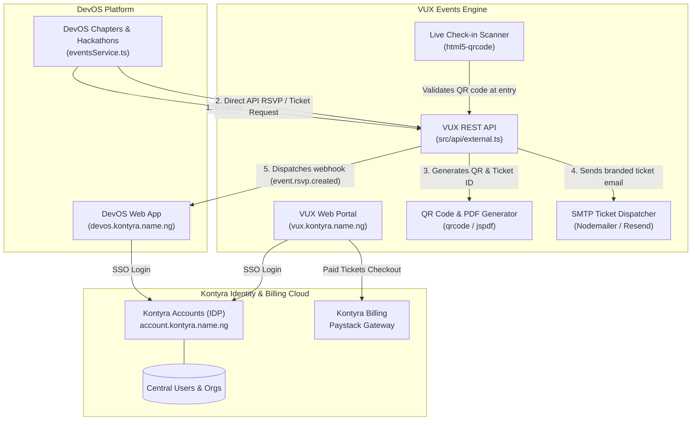

# VUX Events × Kontyra × DevOS: Master Integration Guide

> **System Target**: Unify **VUX Events** (`events.kontyra.name.ng` / `vux.kontyra.name.ng`) with **Kontyra Identity Cloud** (`account.kontyra.name.ng`) and **DevOS Code Execution Platform** (`devos.kontyra.name.ng`).

---

## 1. Executive Summary & The Triad Architecture

The developer ecosystem consists of three specialized, interconnected platforms:

1. **Kontyra Accounts (Identity & Billing)**:
   * Universal Single Sign-On (`@username`, email/password, magic links).
   * Organization workspaces, B2B roles, and Paystack subscription/payment billing.
2. **DevOS (Developer IDE & Community)**:
   * Cloud code execution sandboxes, portfolio hosting, and university/developer chapters.
3. **VUX Events (Event Management & Ticketing)**:
   * Ticketing engine, attendee RSVPs, dynamic QR code passes, check-in scanner, and automated SMTP ticket emails.



---

## 2. Authentication: Migrating VUX to `kontyra-auth`

### Current State
VUX currently manages an isolated authentication state in `src/AuthContext.tsx` with WebAuthn passkeys and local Firebase project `ultra-badge-470321-a1`.

### The Unified Kontyra Auth Solution
By integrating `@kontyra/auth` (or `kontyra-auth`):
1. Attendees log in once with their universal Kontyra account across DevOS, VUX, and Kontyra.
2. Event organizers can publish events under their **Personal Account** or their **Kontyra Organization** (e.g. `Acme Hackathon by Acme Inc`).
3. VUX receives the user's `@username`, verified email, avatar, and tier.

### Implementation in VUX (`src/main.tsx`)
```tsx
import React from "react";
import ReactDOM from "react-dom/client";
import { KontyraProvider } from "kontyra-auth/react";
import App from "./App";
import "./index.css";

ReactDOM.createRoot(document.getElementById("root")!).render(
  <React.StrictMode>
    <KontyraProvider
      config={{
        domain: "https://account.kontyra.name.ng",
        appId: "vux_events",
        redirectUri: window.location.origin,
      }}
    >
      <App />
    </KontyraProvider>
  </React.StrictMode>
);
```

---

## 3. DevOS Integration: Embedding VUX in Hackathons & Chapters

In DevOS, chapters, clubs, and hackathons live in `src/lib/eventsService.ts`. Instead of building custom RSVP tables, DevOS integrates VUX Events in two ways:

### Option A: The Drop-In React Widget (`@vux-events/react` or `src/sdk`)
DevOS embeds the VUX Event widget directly into its project showcase or chapter page:

```tsx
import { VUXEventWidget } from "./sdk/VUXEventWidget";
import { useKontyraAuth } from "kontyra-auth/react";

export function DevOSEventView({ eventId }: { eventId: string }) {
  const { user } = useKontyraAuth();

  return (
    <div className="devos-card">
      <VUXEventWidget
        apiKey={process.env.VITE_VUX_API_KEY}
        eventId={eventId}
        currentUser={
          user
            ? {
                name: user.fullName || `@${user.username}`,
                email: user.email,
              }
            : undefined
        }
        theme="dark"
      />
    </div>
  );
}
```

### Option B: Headless Server-to-Server API
DevOS calls VUX REST API directly from its backend or client:

```typescript
// 1. Create a hackathon in VUX from DevOS
const response = await fetch("https://vux.kontyra.name.ng/api/external/events/create", {
  method: "POST",
  headers: {
    "Content-Type": "application/json",
    "x-api-key": process.env.VUX_API_KEY,
  },
  body: JSON.stringify({
    title: "Kontyra Winter Hackathon 2026",
    description: "Build groundbreaking agentic tools and cloud applications.",
    date: "2026-12-15T09:00:00Z",
    location: "Virtual & Lagos Innovation Hub",
    hostName: "Kontyra Core Team",
    hostEmail: "team@kontyra.name.ng",
    ticketLimit: 500,
  }),
});

const { event } = await response.json();
console.log("VUX Event ID:", event.id);
```

```typescript
// 2. RSVP attendee from DevOS
const rsvpRes = await fetch(`https://vux.kontyra.name.ng/api/external/events/${event.id}/rsvp`, {
  method: "POST",
  headers: {
    "Content-Type": "application/json",
    "x-api-key": process.env.VUX_API_KEY,
  },
  body: JSON.stringify({
    name: user.fullName,
    email: user.email,
  }),
});

const { rsvp } = await rsvpRes.json();
// rsvp.ticketNumber (e.g. "TKT-A92B1C")
```

---

## 4. Ticketing & QR Code Delivery Pipeline

When an attendee RSVPs:
1. **Ticket Minting**: VUX assigns a unique reference: `TKT-<RANDOM-HEX>` (e.g. `TKT-7B29F4`).
2. **Encrypted QR Generation**: A high-density QR code is generated containing:
   ```json
   {
     "eventId": "vux_ev_81923",
     "ticket": "TKT-7B29F4",
     "email": "developer@kontyra.name.ng",
     "sig": "hmac_verified_hash"
   }
   ```
3. **Automated Resend Email Dispatch**:
   Instead of traditional, fragile Gmail SMTP, VUX standardizes on **Resend** (`resend`) for 100% reliable, high-deliverability custom emails with verified DKIM/SPF from `tickets@events.kontyra.name.ng`:

   ```typescript
   import { Resend } from "resend";

   const resend = new Resend(process.env.RESEND_API_KEY);

   export async function sendTicketEmail({
     to,
     name,
     eventTitle,
     eventDate,
     ticketNumber,
     qrDataUrl,
     pdfBuffer,
   }: {
     to: string;
     name: string;
     eventTitle: string;
     eventDate: string;
     ticketNumber: string;
     qrDataUrl: string;
     pdfBuffer?: Buffer;
   }) {
     return await resend.emails.send({
       from: process.env.RESEND_FROM || "VUX Ticketing <tickets@events.kontyra.name.ng>",
       to,
       subject: `Your Pass for ${eventTitle} — ${ticketNumber}`,
       html: `
         <div style="background-color: #000; color: #fff; padding: 40px; font-family: -apple-system, BlinkMacSystemFont, sans-serif; border-radius: 20px; max-width: 500px; margin: 0 auto; border: 1px solid rgba(255,255,255,0.1);">
           <div style="text-align: center; margin-bottom: 24px;">
             <span style="font-size: 11px; letter-spacing: 2px; text-transform: uppercase; color: #60a5fa; font-weight: bold;">Verified Entry Pass</span>
             <h1 style="font-size: 24px; font-weight: 800; margin: 8px 0 0 0; color: #fff;">${eventTitle}</h1>
             <p style="font-size: 14px; color: #a1a1aa; margin: 4px 0 0 0;">${eventDate}</p>
           </div>

           <div style="background: rgba(255,255,255,0.05); border: 1px dashed rgba(255,255,255,0.2); border-radius: 16px; padding: 24px; text-align: center; margin-bottom: 24px;">
             
             <p style="font-family: monospace; font-size: 16px; font-weight: bold; letter-spacing: 2px; color: #34d399; margin: 16px 0 4px 0;">${ticketNumber}</p>
             <p style="font-size: 12px; color: #71717a; margin: 0;">Scan this at the entrance</p>
           </div>

           <div style="border-top: 1px solid rgba(255,255,255,0.1); padding-top: 16px; font-size: 12px; color: #71717a; text-align: center;">
             <p style="margin: 0;">Issued to <strong>${name}</strong> (${to})</p>
             <p style="margin: 6px 0 0 0;">Powered by <strong>VUX Events</strong> & <strong>Kontyra Identity</strong></p>
           </div>
         </div>
       `,
       attachments: pdfBuffer
         ? [
             {
               filename: `${ticketNumber}.pdf`,
               content: pdfBuffer,
             },
           ]
         : undefined,
     });
   }
   ```

4. **Check-In Scanner at the Door**: Event organizers open `vux.kontyra.name.ng/scan` on any mobile phone or tablet to scan badges with zero hardware required (`html5-qrcode`).

---

## 5. Paid Events & Kontyra Paystack Gateway

For paid conferences or premium hackathon tickets:
1. When creating an event in VUX, organizers select **Paid Ticket** and specify the price in NGN (`₦`) or USD (`$`).
2. Attendee clicks **"Buy Ticket"** -> VUX creates a Paystack checkout session via Kontyra Billing:
   ```typescript
   const checkout = await fetch("https://billing.kontyra.name.ng/api/v1/billing/paystack/initialize", {
     method: "POST",
     headers: { Authorization: `Bearer ${user.token}` },
     body: JSON.stringify({
       amount: ticketPrice,
       email: user.email,
       metadata: {
         eventId: event.id,
         ticketType: "VIP",
         platform: "vux_events",
       },
     }),
   });
   ```
3. Upon payment confirmation, Paystack calls the webhook -> VUX generates the ticket and emails the QR code immediately via Resend.

---

## 6. Real-Time Webhooks (VUX → DevOS / Kontyra)

VUX dispatches webhooks to keep DevOS and Kontyra in continuous synchronization:

| Webhook Event | Payload | Action in DevOS / Kontyra |
| :--- | :--- | :--- |
| `event.created` | `{ eventId, title, date, hostName }` | Appears in DevOS Community Feed |
| `event.rsvp.created` | `{ eventId, ticketNumber, userEmail }` | Increments attendee count in DevOS |
| `event.checked_in` | `{ eventId, ticketNumber, timestamp }` | Awards "Attended Event" badge on DevOS profile |

---

## 7. Step-by-Step Rollout Checklist

- [ ] **Step 1: Install `kontyra-auth` in VUX**
  - Replace standalone Firebase auth popup with `<KontyraProvider appId="vux_events">`.
- [ ] **Step 2: Resend API Configuration**
  - Add `RESEND_API_KEY` to `.env`.
  - Verify domain DNS (`events.kontyra.name.ng` or `kontyra.name.ng`) on [resend.com](https://resend.com).
  - Configure `RESEND_FROM=tickets@events.kontyra.name.ng`.
- [ ] **Step 3: Subdomain Configuration**
  - Set canonical host to `events.kontyra.name.ng` or `vux.kontyra.name.ng`.
- [ ] **Step 4: Webhook Registration**
  - In VUX Admin Dashboard, set the Webhook URL to:
    `https://devos.kontyra.name.ng/api/vux-webhook`
- [ ] **Step 5: DevOS Widget & API Embedding**
  - Use Option B (Headless Server-to-Server API) or drop `<VUXEventWidget />` into DevOS chapter/hackathon views.
- [ ] **Step 6: QR Check-In Verification**
  - Test `/scan` camera check-in with a sample ticket.
